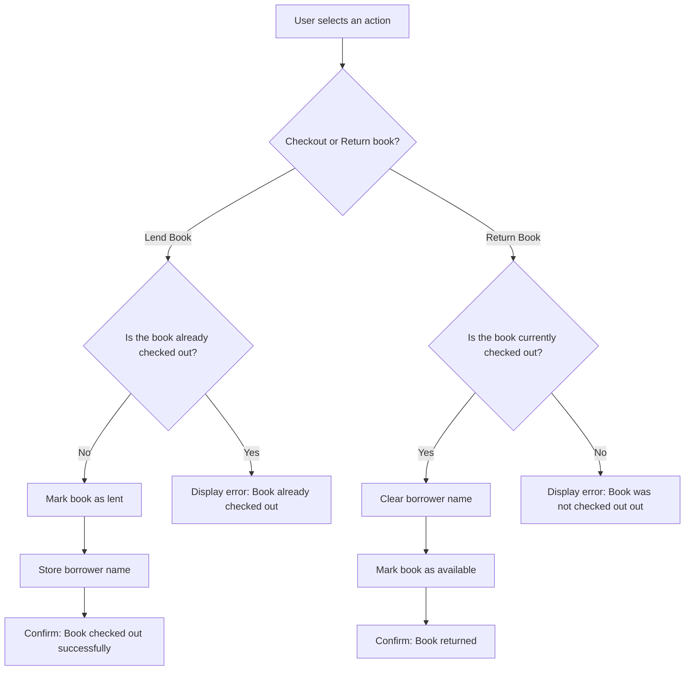

# Retro Media Emporium
Retro Media Emporium (RME) is a Java program I built to track my personal collection of books, DVDs, and CDs. Over the years, I’ve curated a substantial physical media library. Friends often borrow items, and sometimes things don’t make it back or memories of lending fade. RME keeps everything organized, making lending fun, social, and accountable.
<br>
<br>
<br>
<br>
<br>
<br>
## Why I Built This
This project allows me to demonstrate Java skills while celebrating my love of physical media and fostering a sense of community. The next stage is to create scannable little physical cards or a mini card catalog, a combination of a 90s-style library system and Blockbuster video store. 

## Learning Goals 
- Object-oriented programming with classes, encapsulation, methods, and constructors (Book.java and Library.java).
- Strings & data representation for titles, authors, borrower names.
- Control flow with loops and conditionals for menu navigations.
- Collections to manage media using ArrayLists.
- File handling (planned) to save and load the library between sessions, continuity.
   
## Current Features
- Add new books to the library.
- Register friends as borrowers.
- Lend books to friends and mark them as returned.
- View which items are available and which are currently lent out.

## Future Features
- Save and load the library to a file.
- Add DVDs, CDs, and possibly tools like a soldering iron or electronics.
- Physical card catalog/retro UI: bright 80s, icy Y2K, or dark 90s industrial asthetic.
- Create 3D assets in Blender.

## Stack used
- Java
- HTML, CSS, JS (future appearance and interactive upgrades)
- React or Swift (website or app)
- Learn databases to add more users and material

## UI Design Wireframe


## How to run the project:
1. Clone the repository.
2. Open the project in a Java IDE of choice.
3. Run LibraryApp.java, and follow the on-screen menu.

## File Structure
```
RetroMediaEmporium/
├── src/
│   ├── Book.java
│   ├── Library.java
│   └── LibraryApp.java
├── README.md
├── logo.png
└── assets/      (wireframes, mockups, screenshots, GIFs, photos, 3D assets)
```
## Logic Diagram


## Inspiration
Inspired by 90s video stores and classic libraries, RME captures the experience of browsing physical media, sharing it with friends, and keeping things organized in one digital package.

## How to Contribute
Want to contribute? You can add support for site expansion with DVDs and CDs, implement file saving, or create an interactive graphical interface. 
